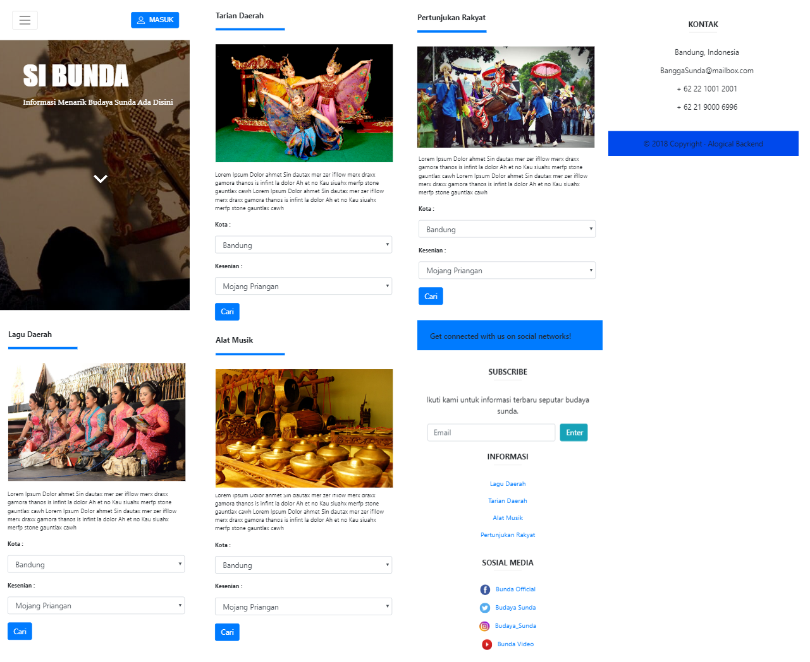

# SIBunda (Sistem Informasi Budaya Sunda)

Desktop View

Smartphone View

## Deskripsi

The design of this program is made purely with only frontend languages like css, js, and html without backend languages like PHP. This design uses bootstrap-4.0.0, animation, and css created by the BAPUS team.

The design of this program also supports responsive systems to be able to appear on various platforms both desktop, tablets, and smartphones.

## How To Run
 1. Download this repo or clone this repo using `git clone https://github.com/lovanto/sibunda.git`
 2. Move this repo to your localhost dir(xampp, appserv, etc.)
 3. And then open it on browser [click here](http://localhost/sibunda) if still default

## Notes
Use this program as a reference not for plagiarism.